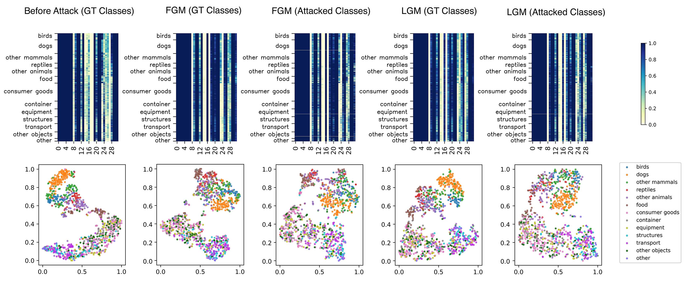

# 二维图像分类攻击

[[English]](README.md)

<p float="left">
    
</p>

本文件夹包含了[SkipNet](https://github.com/ucbdrive/skipnet/)和[DynConv](https://github.com/thomasverelst/dynconv)的攻击代码。

&nbsp;

## 运行需求

本代码库依托CentOS 7.8和GPU RTX_2080

我们提供了一个带有依赖关系的Anaconda环境：

``` 
conda env create -f environment.yml
conda activate dyn_attack
``` 

&nbsp;

## 数据集

CIFAR-10数据集将在运行代码时自动下载。

根据[链接](https://github.com/facebookarchive/fb.resnet.torch/blob/master/INSTALL.md#download-the-imagenet-dataset)下载ImageNet数据集，只需要validation set，下载后的数据集应该被这样放置：

```
data/val/
      |--n01440764/
      |--n01443537/
      |--...
```

&nbsp;

## 模型

### SkipNet
在[链接](https://github.com/ucbdrive/skipnet/tree/master/cifar#demo)和[链接](https://github.com/ucbdrive/skipnet/blob/master/imagenet/README.md)下载训练好的checkpoints，在攻击中我们只使用`resnet-110-rnn-cifar10.pth.tar`和`resnet-101-rnn-imagenet.pth.tar`，将下载的checkpoints放置于文件夹`skipnet/checkpoints/`之下。

### DynConv
在[链接](https://github.com/thomasverelst/dynconv/tree/master/classification#trained-models)下载训练好的checkpoints，在攻击中对于CIFAR-10数据集使用sparse05的ResNet32，对于ImageNet数据集使用sparse05的ResNet101，将下载的checkpoints放置于文件夹`dynconv/`之下。 

### ResNet
在[链接](skipnet/cifar/pytorch_resnet_cifar10/README.md)下载训练好的checkpoints，在攻击中对于CIFAR-10数据集使用ResNet32和ResNet110，将下载的checkpoints放置于文件夹`skipnet/cifar/pytorch_resnet_cifar10/pretrained_models/`之下。ImageNet数据集的的checkpoints将自动在运行代码时下载。

&nbsp;

## 攻击

### FGSM攻击
- FGM

``` 
python attack.py --model <skipnet|dynconv|resnet> --dataset <cifar|imagenet> --type fgm --eps <epsilon> --lr <step size> --batch_size <batch size>
``` 

- LGM

``` 
python attack.py --model <skipnet|dynconv|resnet> --dataset <cifar|imagenet> --type lgm --eps <epsilon> --lr <step size> --batch_size <batch size> --lamb <lamb>
``` 

### BIM攻击
- FGM

``` 
python attack.py --model <skipnet|dynconv|resnet> --dataset <cifar|imagenet> --type fgm --eps <epsilon> --batch_size <batch size> --n_iter <iter> --mask_rate <mask rate>
``` 

- LGM

``` 
python attack.py --model <skipnet|dynconv|resnet> --dataset <cifar|imagenet> --type lgm --eps <epsilon> --batch_size <batch size> --n_iter <iter> --mask_rate <mask rate> --lamb <lamb>
``` 

### PGD攻击
- FGM

``` 
python attack.py --model <skipnet|dynconv|resnet> --dataset <cifar|imagenet> --type fgm --eps <epsilon> --batch_size <batch size> --n_iter <iter> --mask_rate <mask rate> -pgd
``` 

- LGM

``` 
python attack.py --model <skipnet|dynconv|resnet> --dataset <cifar|imagenet> --type lgm --eps <epsilon> --batch_size <batch size> --n_iter <iter> --mask_rate <mask rate> -pgd --lamb <lamb>
``` 

### CW攻击
- FGM

``` 
python attack.py --model <skipnet|dynconv|resnet> --dataset <cifar|imagenet> --type fgm --eps <epsilon> --batch_size <batch size> --n_iter <iter> --mask_rate <mask rate> --loss cw -adam
``` 

- LGM

``` 
python attack.py --model <skipnet|dynconv|resnet> --dataset <cifar|imagenet> --type lgm --eps <epsilon> --batch_size <batch size> --n_iter <iter> --mask_rate <mask rate> --loss cw -adam --lamb <lamb>
``` 

### APGD攻击
- FGM

``` 
python attack.py --model <skipnet|dynconv|resnet> --dataset <cifar|imagenet> --type fgm --eps <epsilon> --batch_size <batch size> --n_iter <iter> --mask_rate <mask rate> -auto_lr 
``` 

- LGM

``` 
python attack.py --model <skipnet|dynconv|resnet> --dataset <cifar|imagenet> --type lgm --eps <epsilon> --batch_size <batch size> --n_iter <iter> --mask_rate <mask rate> -auto_lr --lamb <lamb>
``` 

其他参数：

- `-t`：Targeted attack
- `--resnet <type>`：指定ResNet类型，例如`--resnet 32`
- `--save`：保存攻击结果

&nbsp;

## 分析

运行`analysis.py`绘图热力图和T-SNE结果。

&nbsp;

## LGM的Lambda参数
### 单步攻击（FGSM）

- CIFAR-10

| 模型 | epsilon = 1 | epsilon = 2 | epsilon = 4 | epsilon = 8 | 
| :---: | :---: | :---: | :---: | :---: | 
| SkipNet | 0.5 | 0.3 | 0.2 | 0.2 | 
| DynConv | 0.5 | 0.2 | 0.1 | 0.0001 | 


- ImageNet

| 模型 | epsilon = 1 | epsilon = 2 | epsilon = 4 | epsilon = 8 | epsilon = 16 | 
| :---: | :---: | :---: | :---: | :---: | :---: | 
| SkipNet | 0.3 | 0.005 | 0.005 | 0.0025 | 0.0001 | 
| DynConv | 5 | 0.05 | 0.005 | 0.001 | 0.001 |

### 迭代攻击

- CIFAR-10，有效pixel为5%

| 模型 | BIM | PGD | CW | APGD | BIM (Targeted) | PGD (Targeted) | CW (Targeted) | APGD (Targeted) | 
| :---: | :---: | :---: | :---: | :---: | :---: | :---: | :---: | :---: | 
| SkipNet | 5 | 5 | 35 | 5 | 5 | 5 | 30 | 5 | 
| DynConv | 10 | 10 | 45 | 10 | 10 | 10 | 45 | 10 | 
