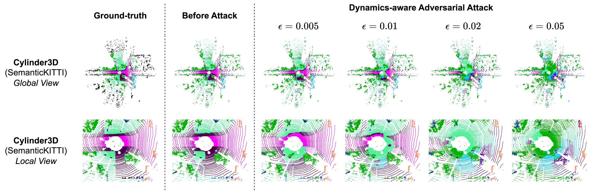

# 三维点云室外场景分割的攻击

[[English]](README.md)

    

本文件夹包括了[SemanticKITTI](http://www.semantic-kitti.org/)数据集的代码，代码依据[Cylinder3D](https://github.com/xinge008/Cylinder3D)代码库建立。

我们提供了两个版本的`spconv`支持，两个版本的代码运行结果一致。关于两个版本`spconv 1.x`和`spconv 2.x`的区别详见这个[链接](https://github.com/xinge008/Cylinder3D/issues/107#issuecomment-1592291831)。