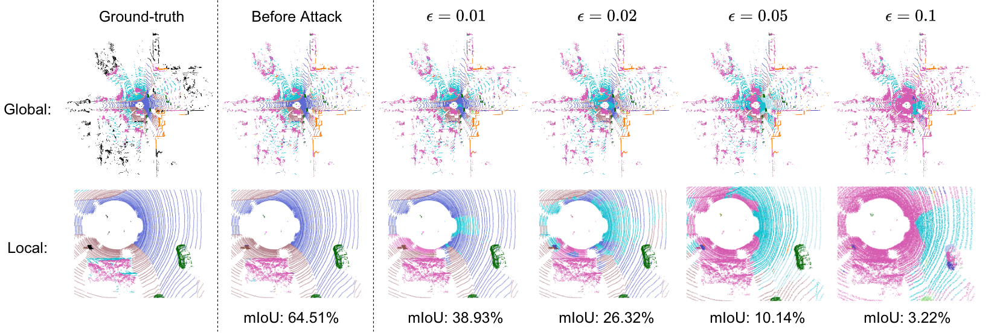

# Attack of 3D Point Cloud Outdoor Scene Segmentation

[[中文版]](README_zh.md)

<p float="left">
    
</p>

This folder contains codes for the [SemanticKITTI](http://www.semantic-kitti.org/) dataset. The codes are built from [Cylinder3D](https://github.com/xinge008/Cylinder3D).

&nbsp;

### Requirements
Please follow the instructions in [Cylinder3D](https://github.com/xinge008/Cylinder3D) to install required packages. In this folder, the code is built under `spconv 2.3.6` with `cuda 11.6`.

### Dataset

1. Download the SemanticKITTI dataset from the [official website](http://www.semantic-kitti.org/dataset.html#download). 
2. Set your dataset path in `config/semantickitti.yaml`.

### Model

In our work, we adopt the pretrained model provided by Cylinder3D official repo, which can be downloaded [here](https://github.com/xinge008/Cylinder3D#pretrained-models). Remember to set your model path in `config/semantickitti.yaml`.

### Start Attack

Use the following command to attack using FGM with an assigned budget `<budget>`. 
```
python fgm.py --budget <budget>
``` 

Use the following command to attack using LGM with an assigned budget `<budget>`. 
```
python lgm.py --budget <budget>
``` 

You need to use `CUDA_VISIBLE_DEVICES` to specify the GPU cards in the experiment.

You can add additional arguments at the end of the above command to control the attack process.

- `--exp_name <name>` Assign an experiment name. Default is `Logs_<date>_<time>`.
- `--save_coords` Whether to save attacked point cloud coordinates. Default is `False`.
- `--save_preds` Whether to save the class prediction results for the attacked network. Default is `False`.
- `--save_probs` Whether to save the probability values of classes for the attacked network. Default is `False`.

### Resume Attack

We recommend using `--save_coords` during the attack process. With the saved attacked point cloud coordinates, you can resume the attack using `--resume_path <resume path>`. Also, you can use the saved attacked point cloud coordinates to run the evaluation script `eval_scannet.py` in the next section.

- `--resume_path <resume path>` Resume the attack with an experiment path. The format of the path is `outputs/budget_<your budget>/<your exp name>`. You need to make sure that you have used `--save_coords` in the resumed attack.

### Change Attack Parameters

If the attack budget lies in [0.005, 0.01, 0.02, 0.05], our script default loads our fine-tuned attack parameters. You can change them on your own with the following arguments.

- `--default_para` Whether to use default attack parameters for budget that lies in [0.005, 0.01, 0.02, 0.05]. Default is `True`.
- `--iter_num <num>` The iteration numer for attack.
- `--step <size>` The step size for each attack step.
- `--lamda_input <value>` This parameter controls the slop of the sigmoid-like function in input voxelization.
- `--lamda_conv <value>` This parameter controls the slop of the sigmoid-like function in the occupancy value in sparse convolution.

### Other

Use the following command to evaluate the model performance with unattacked point cloud coordinates.

```
python test.py
```

Our script can reproduce 66.91% mIoU on the validation set.

### Performance

| Method | Budget = 0.005 m | Budget = 0.01 m | Budget = 0.02 m | Budget = 0.05 m | 
| :---: | :---: | :---: | :---: | :---: | 
| FGM | 34.43 | 29.77 | 16.02 | 9.17 | 
| LGM | 33.63 | 29.13 | 15.17 | 8.50 | 
