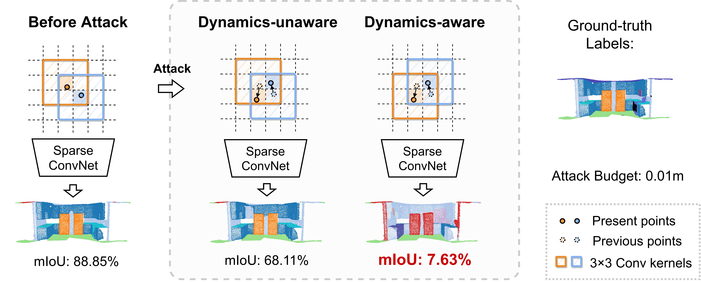

# Leaded Gradient Method (LGM)

[[中文版]](README_zh.md)

<p float="left">
    
</p>

This repository contains the PyTorch implementation for paper **Dynamics-aware Adversarial Attack of 3D Sparse Convolution Network**

**Authors:** An Tao, Yueqi Duan, He Wang, Ziyi Wu, Pengliang Ji, Haowen Sun, Jie Zhou, Jiwen Lu

[[arxiv]](https://arxiv.org/abs/2112.09428)

In this paper, we investigate the dynamics-aware adversarial attack problem in deep neural networks. Most existing adversarial attack algorithms are designed under a basic assumption -- the network architecture is fixed throughout the attack process. However, this assumption does not hold for many recently proposed networks, e.g. 3D sparse convolution network, which contains input-dependent execution to improve computational efficiency. It results in a serious issue of lagged gradient, making the learned attack at the current step ineffective due to the architecture changes afterward. To address this issue, we propose a Leaded Gradient Method (LGM) and show the significant effects of the lagged gradient. 

If you find our work useful in your research, please consider citing our paper.

```
@article{tao2021dynamicsaware,
  title={Dynamics-aware Adversarial Attack of 3D Sparse Convolution Network},
  author={Tao, An and Duan, Yueqi and Wang, He and Wu, Ziyi and Ji, Pengliang and Sun, Haowen and Zhou, Jie and Lu, Jiwen},
  journal={arXiv preprint arXiv:2112.09428},
  year={2021}
}
```

&nbsp;

**Updates:** 

- [2022/5/20] Add attack code for 3D point cloud indoor scene semantic segmentation.

&nbsp;

## Contents

- [3D Point Cloud Indoor Scene Segmentation](indoor_scene/)
