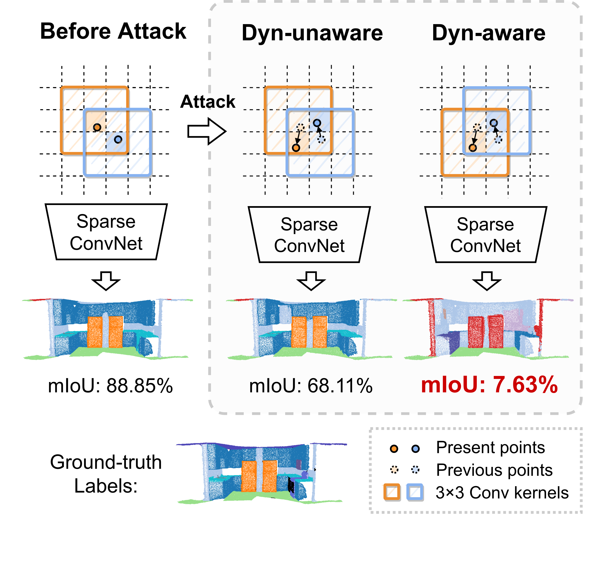

# 超前梯度法（LGM）

[[English]](README.md)

<p float="left">
    
</p>

本代码库包含了文章**Dynamics-aware Adversarial Attack of Adaptive Neural Networks**的PyTorch实现代码。

**作者：** 陶安，段岳圻，王英琦，鲁继文，周杰

[[论文]](https://arxiv.org/abs/2210.08159)

在论文中，我们研究了自适应神经网络中的动态感知对抗攻击问题（Dynamics-aware Adversarial Attack）。目前大多数网络方法默认网络在攻击前后网络结构不会发生变化，但是此假设并不适用于很多近期提出的自适应神经网络，这些自适应神经网络会根据不同的输入数据自适应地关闭一些不重要的运算单元。这种网络在攻击中存在严重的梯度滞后问题，即由于攻击前后的网络架构变化，使得当前步骤学习的攻击在变化后的网络结构中变得无效。为了解决这个问题，我们提出了一种超前梯度法（LGM），并在实验中展示了滞后梯度造成的显著影响。

我们的会议预印版本可以在[这里](https://arxiv.org/abs/2210.08159)找到。

如果您发现我们的工作对您的研究有帮助，您可以考虑引用我们的论文。

```
@article{tao2022dynamicsaware,
  title={Dynamics-aware Adversarial Attack of Adaptive Neural Networks},
  author={Tao, An and Duan, Yueqi and Yingqi, Wang and Lu, Jiwen and Zhou, Jie},
  journal={https://arxiv.org/abs/2210.08159},
  year={2022}
}
```

&nbsp;

**更新：** 

- [2022/10/17] 论文的期刊预印版本可以在arXiv上预览了。
- [2022/05/20] 增加三维点云室内场景分割的攻击代码。

&nbsp;

## 内容

- [三维点云室内场景分割](indoor_scene/)
