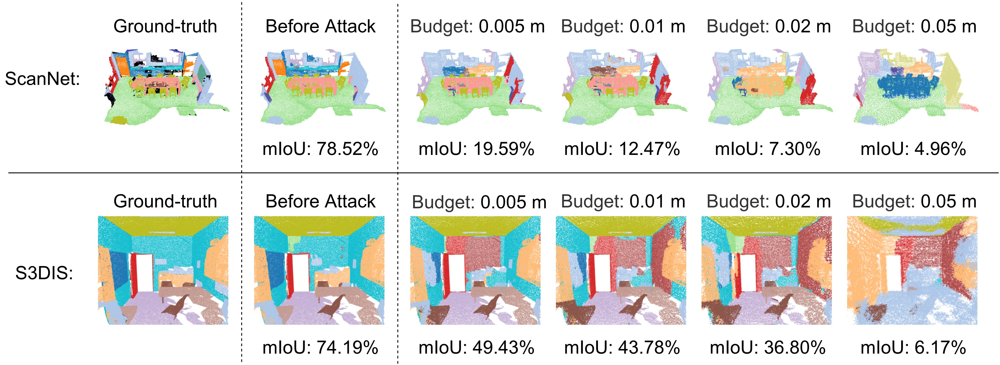

# 三维点云室内场景分割的攻击

[[English]](README.md)

<p float="left">
    
</p>

本文件夹包括了[ScanNet](http://kaldir.vc.in.tum.de/scannet_benchmark/documentation)数据集和[Stanford (S3DIS)](http://buildingparser.stanford.edu/dataset.html)数据集的代码，代码依据[SpatioTemporalSegmentation](https://github.com/chrischoy/SpatioTemporalSegmentation)代码库建立。

&nbsp;

## 运行需求
请依据[SpatioTemporalSegmentation](https://github.com/chrischoy/SpatioTemporalSegmentation)代码库中指示安装所需要的包。

我们推荐您使用[Anaconda](https://www.anaconda.com/)来安装Minkowski Engine，相关的安装步骤可以参考[Minkowski Engine 0.4.3](https://github.com/NVIDIA/MinkowskiEngine/tree/v0.4.3#anaconda)代码库。你需要确保你下载的是0.4.3版本安装包，不是最新版。

在[这里](INSTALL_zh.md)我们提供了一份安装示例。

&nbsp;

## ScanNet数据集

### 前期准备

#### 数据集

1. 从[官方网站](http://kaldir.vc.in.tum.de/scannet_benchmark/documentation)下载ScanNet数据集，你需要同意ScanNet数据集使用须知。
2. 使用下面命令去处理所有原始点云数据。在运行前你需要在`lib/datasets/preprocessing/scannet.py`文件中修改`SCANNET_RAW_PATH`和`SCANNET_OUT_PATH`的路径。

``` 
python -m lib.datasets.preprocessing.scannet
``` 

#### 模型

在本工作中，我们在[模型库](https://github.com/chrischoy/SpatioTemporalSegmentation#model-zoo)中选择使用2厘米体素和conv1卷积核大小为5的Mink16UNet34C模型，在[这里](https://node1.chrischoy.org/data/publications/minknet/MinkUNet34C-train-conv1-5.pth)可以下载训练好的模型`MinkUNet34C-train-conv1-5.pth`，模型下载后请将其放置在`weights/`文件夹内。

### 开始攻击

在给定最大攻击幅度`<budget>`下，使用如下命令去攻击。数据路径`<data path>`是`SCANNET_OUT_PATH/train`。

```
python adv_scannet.py --data_path <data path> --budget <budget>
``` 

你需要使用`CUDA_VISIBLE_DEVICES`去指定实验中具体使用哪些GPU卡，否则脚本将会使用所有GPU卡。例如，在上述命令开头加入`CUDA_VISIBLE_DEVICES=0,1,2,3`去指定使用编号为`0,1,2,3`的4张GPU卡，或者在脚本中添加`os.environ["CUDA_VISIBLE_DEVICES"] = "0,1,2,3"`。

你可以通过在上述命令的末尾增加下面这些额外的指令来控制攻击的具体过程。

- `--exp_name <name>` 指定一个实验名称，如果不指定则实验名称默认是`Logs_<日期>_<时间>`。
- `--dynamics_aware` 本次攻击是否是动态感知的，默认是`True`。
- `--save_coords` 是否保存攻击后的点云坐标，默认是`False`。
- `--save_preds` 是否保存攻击后模型的预测结果，默认是`False`。
- `--save_probs` 是否保存攻击后模型的各类别预测分数，默认是`False`。
- `--visual` 是否保存`.ply`格式的可视化结果，默认是`False`。

### 恢复攻击

我们建议您在攻击时使用`--save_coords`命令，这样攻击时可以保存攻击过后的点云坐标。当程序意外终止时，通过这些已保存的点云坐标您可以在攻击命令中添加命令`--resume_path <resume path>`恢复上次攻击。

- `--resume_path <resume path>` 恢复某次攻击实验，路径的格式是`outputs/scannet/budget_<your budget>/<your exp name>`。你需要确保在需要恢复的攻击实验中，之前已经使用了`--save_coords`命令。

### 改变攻击参数

如果攻击的最大攻击幅度是列表[0.005, 0.01, 0.02, 0.05]中的一个，脚本将自动加载我们调好的攻击参数，您可以根据您的需要通过下面的指令修改攻击参数。

- `--default_para` 当攻击的最大攻击幅度是列表[0.005, 0.01, 0.02, 0.05]中的一个，是否使用默认攻击参数，默认是`True`。
- `--iter_num <num>` 攻击迭代数量。
- `--step <size>` 攻击步长。
- `--lamda_input` 本参数控制在模型输入体素化（voxelization）处S形函数（sigmoid-like function）的斜度。
- `--lamda_conv` 本参数控制在稀疏卷积的占用值（occupancy value）处S形函数（sigmoid-like function）的斜度。
- `--lamda_output` 本参数控制在模型输出反体素化（devoxelization）处S形函数（sigmoid-like function）的斜度。

### 评估

使用如下命令使用未攻击的点云坐标来测试模型性能，输出结果反映了攻击前模型的性能。

```
python eval_scannet.py --data_path <data path>
```

我们的脚本能够对模型`MinkUNet34C-train-conv1-5.pth`在验证集上复现出mIoU 72.22%性能。

当攻击过后，您可以使用如下命令使用攻击后的点云坐标来测试模型性能，输出结果反映了攻击后模型的性能。攻击后的点云坐标路径`<coord path>`的格式是`outputs/scannet/budget_<your budget>/<your exp name>/coord`。
```
python eval_scannet.py --data_path=<data path> --attacked_coords=<coord path>
```

同样，您可以通过在上述两条命令末尾增加额外的指令来控制模型评估过程。

- `--exp_name <name>` 指定一个实验名称，如果不指定则实验名称默认是`Logs_<日期>_<时间>`。
- `--save_preds` 是否保存模型的预测结果，默认是`False`。
- `--save_probs` 是否保存模型的各类别预测分数，默认是`False`。
- `--visual` 是否保存`.ply`格式的可视化结果，默认是`False`。

### 性能

| 方法 | 最大攻击幅度 = 0.005 m | 最大攻击幅度 = 0.01 m | 最大攻击幅度 = 0.02 m | 最大攻击幅度 = 0.05 m | 
| :---: | :---: | :---: | :---: | :---: | 
| FGM | 60.44 | 55.51 | 38.65 | 8.70 | 
| LGM | **25.79** | **11.51** | **5.76** | **3.83** | 

因为我们修改了代码中的一些错误，本代码库中攻击性能会略优于上述展示的我们文章中汇报的性能。

&nbsp;

## Stanford 3D数据集（S3DIS）

### 前期准备

#### 数据集

1. 从[官方网站](http://buildingparser.stanford.edu/dataset.html)下载Stanford 3D数据集，你需要同意Stanford 3D数据集使用须知。
2. 使用下面命令去处理所有原始点云数据。在运行前你需要在`lib/datasets/preprocessing/stanford.py`文件中修改`STANFORD_3D_IN_PATH`和`STANFORD_3D_OUT_PATH`的路径。

``` 
python -m lib.datasets.preprocessing.stanford
``` 

#### 模型

在本工作中，我们在[模型库](https://github.com/chrischoy/SpatioTemporalSegmentation#model-zoo)中选择使用5厘米体素和conv1卷积核大小为5的Mink16UNet34模型，在[这里](https://node1.chrischoy.org/data/publications/minknet/Mink16UNet34-stanford-conv1-5.pth)可以下载训练好的模型`Mink16UNet34-stanford-conv1-5.pth`，模型下载后请将其放置在`weights/`文件夹内。

### 开始攻击

在给定最大攻击幅度`<budget>`下，使用如下命令去攻击。数据路径`<data path>`是`STANFORD_3D_OUT_PATH`。

```
python adv_stanford.py --data_path <data path> --budget <budget> 
``` 

你需要使用`CUDA_VISIBLE_DEVICES`去指定实验中具体使用哪些GPU卡，否则脚本将会使用所有GPU卡。例如，在上述命令开头加入`CUDA_VISIBLE_DEVICES=0,1,2,3`去指定使用编号为`0,1,2,3`的4张GPU卡，或者在脚本中添加`os.environ["CUDA_VISIBLE_DEVICES"] = "0,1,2,3"`。

你可以通过在上述命令的末尾增加下面这些额外的指令来控制攻击的具体过程。

- `--exp_name <name>` 指定一个实验名称，如果不指定则实验名称默认是`Logs_<日期>_<时间>`。
- `--dynamics_aware` 本次攻击是否是动态感知的，默认是`True`。
- `--save_coords` 是否保存攻击后的点云坐标，默认是`False`。
- `--save_preds` 是否保存攻击后模型的预测结果，默认是`False`。
- `--save_probs` 是否保存攻击后模型的各类别预测分数，默认是`False`。
- `--visual` 是否保存`.ply`格式的可视化结果，默认是`False`。

### 恢复攻击

我们建议您在攻击时使用`--save_coords`命令，这样攻击时可以保存攻击过后的点云坐标。当程序意外终止时，通过这些已保存的点云坐标您可以在攻击命令中添加命令`--resume_path <resume path>`恢复上次攻击。

- `--resume_path <resume path>` 恢复某次攻击实验，路径的格式是`outputs/stanford/budget_<your budget>/<your exp name>`。你需要确保在需要恢复的攻击实验中，之前已经使用了`--save_coords`命令。

### 改变攻击参数

如果攻击的最大攻击幅度是列表[0.005, 0.01, 0.02, 0.05]中的一个，脚本将自动加载我们调好的攻击参数，您可以根据您的需要通过下面的指令修改攻击参数。

- `--default_para` 当攻击的最大攻击幅度是列表[0.005, 0.01, 0.02, 0.05]中的一个，是否使用默认攻击参数，默认是`True`。
- `--iter_num <num>` 攻击迭代数量。
- `--step <size>` 攻击步长。
- `--lamda_input` 本参数控制在模型输入体素化（voxelization）处S形函数（sigmoid-like function）的斜度。
- `--lamda_conv` 本参数控制在稀疏卷积的占用值（occupancy value）处S形函数（sigmoid-like function）的斜度。
- `--lamda_output` 本参数控制在模型输出反体素化（devoxelization）处S形函数（sigmoid-like function）的斜度。
- `--lamda_floor` 本参数控制S形函数（sigmoid-like function）在模拟阶梯函数（floor function）时的斜度。

### 评估

使用如下命令使用未攻击的点云坐标来测试模型性能，输出结果反映了攻击前模型的性能。

```
python eval_stanford.py --data_path <data path>
```

我们的脚本能够对模型`Mink16UNet34-stanford-conv1-5.pth`在数据集区域5上复现出mIoU 65.47%性能。

当攻击过后，您可以使用如下命令使用攻击后的点云坐标来测试模型性能，输出结果反映了攻击后模型的性能。攻击后的点云坐标路径`<coord path>`的格式是`outputs/stanford/budget_<your budget>/<your exp name>/coord`。

```
python eval_stanford.py --data_path=<data path> --attacked_coords=<coord path>
```

同样，您可以通过在上述两条命令末尾增加额外的指令来控制模型评估过程。

- `--exp_name <name>` 指定一个实验名称，如果不指定则实验名称默认是`Logs_<日期>_<时间>`。
- `--area <id>` 使用的数据集区域，默认是`5`。
- `--save_preds` 是否保存模型的预测结果，默认是`False`。
- `--save_probs` 是否保存模型的各类别预测分数，默认是`False`。
- `--visual` 是否保存`.ply`格式的可视化结果，默认是`False`。

### 性能

| 方法 | 最大攻击幅度 = 0.005 m | 最大攻击幅度 = 0.01 m | 最大攻击幅度 = 0.02 m | 最大攻击幅度 = 0.05 m | 
| :---: | :---: | :---: | :---: | :---: | 
| FGM | 57.53 | 52.35 | 45.24 | 21.21 | 
| LGM | **48.20** | **39.65** | **30.93** | **7.45** | 

因为我们修改了代码中的一些错误，本代码库中攻击性能会略优于上述展示的我们文章中汇报的性能。
